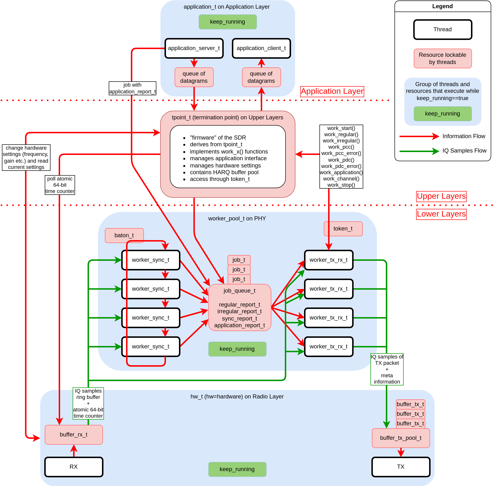

<p align="center">
  
</p>

This repository contains my work-in-progress SDR implementation of DECT NR+ ([ETSI TS 103 636, Part 1 to 5](https://www.etsi.org/committee/1394-dect)) with the following features:

- **Extensive**: supports all values of $\mu$, $\beta$ and N<sub>TX</sub>
- **Extensible**: enables custom firmware based on slim interfaces to the PHY and application layer
- **Fast**: supports low latencies (<250 $\mu s$) and high data rates (>100 $Mbps$)
- **Reliable**: supports MIMO (transmit diversity, beamforming etc.) for diversity combining and SINR maximization

DECT NR+ is a non-cellular radio standard and part of [5G as defined by ITU-R](https://www.etsi.org/newsroom/press-releases/1988-2021-10-world-s-first-non-cellular-5g-technology-etsi-dect-2020-gets-itu-r-approval-setting-example-of-new-era-connectivity). Introductions are available at [ETSI](https://www.etsi.org/technologies/dect), [DECT Forum](https://www.dect.org/nrplus) and [Wikipedia](https://en.wikipedia.org/wiki/DECT-2020). While commonly referred to as DECT NR+, the standard's official designation is DECT-2020 New Radio (NR).

## Table of Contents

1. [Core Idea](#core-idea)
2. [Directories](#directories)
3. [Installation](#installation)
4. [Starting](#starting)
5. [Contributing](#contributing)
6. [Citation](#citation)
7. [Limitations of an SDR with Host Processing](#limitations-of-an-sdr-with-host-processing)
8. [Known Issues](#known-issues)
9. [Future Work](#future-work)
10. [Troubleshooting](#troubleshooting)

Advanced Topics

1. [Architecture](#architecture)
2. [AGC](#agc)
3. [Resampling](#resampling)
4. [Synchronization](#synchronization)
5. [Compatibility](#compatibility)
6. [JSON Export](#json-export)
7. [PPS Export and PTP](#pps-export-and-ptp)
8. [Host and SDR Tuning](#host-and-sdr-tuning)
9. [Firmware](#firmware)
    1. [basic](#basic)
    2. [chscanner](#chscanner)
    3. [loopback](#loopback)
    4. [p2p](#p2p)
    5. [rtt](#rtt)
    6. [timesync](#timesync)

## Core Idea

The core idea of the SDR is to provide a basis to write custom DECT NR+ firmware. In terms of the OSI model, the firmware is located on the MAC layer and the layers above as shown in [Architecture](#architecture). The SDR provides:

- Radio layer (typically part of PHY, here separate layer)
- PHY
- PHY to MAC layer interface
- Application layer interface (e.g. UDP sockets, virtual NIC).

Custom DECT NR+ firmware is implemented by deriving from the class [tpoint_t](lib/include/dectnrp/upper/tpoint.hpp) and implementing its virtual functions. The abbreviation tpoint stands for [termination point](https://www.dect.org/dect-nrplus-standard-upper-layers-technology-faq-blog) which is DECT terminology and simply refers to a DECT NR+ node. There are multiple firmware examples in [lib/include/dectnrp/upper/tpoint_firmware/](lib/include/dectnrp/upper/tpoint_firmware/) with a brief description of each available under [Firmware](#firmware). For instance, the termination point firmware (tfw) [tfw_basic_t](lib/include/dectnrp/upper/tpoint_firmware/basic/tfw_basic.hpp) provides the most basic firmware possible. It derives from [tpoint_t](lib/include/dectnrp/upper/tpoint.hpp) and leaves all virtual functions mostly empty. The full list of virtual functions is:

|   | **Virtual Function**  | **Properties**                                                            |
|---|-----------------------|---------------------------------------------------------------------------|
| 1 | work_start_imminent() | called once immediately before IQ sample processing begins                |
| 2 | work_regular()        | called regularly (polling)                                                |
| 3 | work_pcc()            | called upon PCC reception with correct CRC (event-driven)                 |
| 4 | work_pcc_crc_error()  | called upon PCC reception with incorrect CRC (event-driven, optional)     |
| 5 | work_pdc_async()      | called upon PDC reception (event-driven)                                  |
| 6 | work_upper()          | called upon availability of new data on application layer (event-driven)  |
| 7 | work_chscan_async()   | called upon finished channel measurement (event-driven)                   |
| 8 | start_threads()       | called once during SDR startup to start application layer threads         |
| 9 | stop_threads()        | called once during SDR shutdown to stop application layer threads         |

For any firmware, constructors are always called first. When the constructors are called, the underlying radio devices have already been initialized and hardware properties such as center frequency and gains may be changed. However, the radio devices are not streaming IQ samples yet.

After all constructors have been called, start_threads() is called followed by work_start_imminent() which announces the beginning of IQ streaming. Only then all other work-functions are called. For event-driven functions, calls are only made if and when the associated event occurs. Once the SDR receives a signal triggered by pressing ctrl+c, stop_threads() is called and the running firmware must stop such that the SDR can shut down.

## Directories

    ├─ .devcontainer/           docker container setup in VSCode
    ├─ .vscode/                 VS Code settings
    ├─ apps/                    apps sources
    ├─ bin/                     apps post-compilation binaries
    ├─ cmake/                   CMake modules
    ├─ configurations/          configuration files required to start the SDR
    ├─ docs/                    documentation (doxygen, graphics etc.)
    ├─ external/                external libraries
    ├─ gnuradio/                flow graphs (SDR oscilloscope, USRP calibration etc.)
    ├─ json/                    submodule to analyze exported JSON files in Matlab
    ├─ lib/                     library code used by applications
    │  ├─ include/dectnrp/
    │  |  ├─ application/       application layer interfaces
    │  |  ├─ apps/              utilities for apps in directory apps/
    │  |  ├─ common/            common functionality across all layers/directories
    │  |  ├─ dlccl/             DLC and convergence layer
    │  |  ├─ mac/               MAC layer
    │  |  ├─ phy/               physical layer
    │  |  ├─ radio/             radio layer
    │  |  ├─ sections_part2/    sections of ETSI TS 103 636-2
    │  |  ├─ sections_part3/    sections of ETSI TS 103 636-3
    │  |  ├─ sections_part4/    sections of ETSI TS 103 636-4
    │  |  ├─ sections_part5/    sections of ETSI TS 103 636-5
    │  |  ├─ simulation/        wireless simulation
    │  |  ├─ upper/             upper layers, i.e. layers between PHY and application layer
    │  ├─ src/                  source code (same directories as in include/dectnrp/)
    └─ scripts/                 shell scripts

## Installation

The SDR has been tested on Ubuntu 22.04 and 24.04. It has four dependencies that must be installed:
- [UHD](https://github.com/EttusResearch/uhd): Radio Devices
- [srsRAN 4G](https://github.com/srsran/srsRAN_4G): Turbo coding, PHY processing, SIMD
- [VOLK](https://github.com/gnuradio/volk): SIMD
- [Eigen](https://eigen.tuxfamily.org/index.php?title=Main_Page): Matrix Inversion

Installation instructions for these dependencies can be found in [scripts/install_dependencies.sh](scripts/install_dependencies.sh). After installing the dependencies, the SDR can be either downloaded and compiled with [scripts/install_sdr.sh](scripts/install_sdr.sh), or manually with: 

```shell
git clone --recurse-submodules https://github.com/maxpenner/DECT-NR-Plus-SDR
cd DECT-NR-Plus-SDR
mkdir build
cd build
cmake ..
make
```
The compiled code is kept local in [bin/](bin/) and not copied to any operating system directories such as `usr/local/`.

## Starting

To start the SDR, the main executable `dectnrp` must be invoked. It is located in [bin/](bin/) after compilation.

```shell
cd bin/
sudo ./dectnrp "../configurations/basic_simulator/"
```

The executable `dectnrp` requires exactly one argument, which is a path to a directory containing three configuration files `radio.json`, `phy.json` and `upper.json` as exemplified in [configurations/](configurations/). Each configuration file configures its respective layer(s). In the case of `upper.json`, this also implies the name of the firmware to load. The SDR is stopped by pressing ctrl+c.

The configuration files may also contain multiple instances of the SDR. In fact, each configuration file configures its layer(s) by listing one or multiple layer units:

- `radio.json`: list of hardwares [hw_t](lib/include/dectnrp/radio/hw.hpp) (e.g. USRP or simulator), details in [hw_config_t](lib/include/dectnrp/radio/hw_config.hpp)
- `phy.json`: list of worker pools [worker_pool_t](lib/include/dectnrp/phy/worker_pool.hpp), details in [worker_pool_config_t](lib/include/dectnrp/phy/worker_pool_config.hpp)
- `upper.json`: list of termination points [tpoint_t](lib/include/dectnrp/upper/tpoint.hpp), details in [tpoint_config_t](lib/include/dectnrp/upper/tpoint_config.hpp)

<p align="center">
  
</p>

If `radio.json` and `phy.json` contain multiple layer instances, each trio of [tpoint_t](lib/include/dectnrp/upper/tpoint.hpp), [worker_pool_t](lib/include/dectnrp/phy/worker_pool.hpp) and [hw_t](lib/include/dectnrp/radio/hw.hpp) is either started independently (center figure), or a single [tpoint_t](lib/include/dectnrp/upper/tpoint.hpp) controls multiple duos of [worker_pool_t](lib/include/dectnrp/phy/worker_pool.hpp) and [hw_t](lib/include/dectnrp/radio/hw.hpp) (right figure).

Furthermore, a set of configuration files is not bound to a specific firmware. By replacing the firmware name in `upper.json`, the configuration files can be combined with a different firmware. It is up to the firmware to verify at runtime whether the applied configuration is compatible.

## Contributing

Submit a pull request and keep the same licence.

## Citation

If you use this repository for any publication, please cite the repository according to [CITATION.cff](CITATION.cff).

## Limitations of an SDR with Host Processing

All processing of IQ samples and all decisions about the radio device state (gains, frequencies etc.) are made on the host. The host exchanges IQ samples and the radio device state with the radio device over an interface (100/10/1GbE, PCIe, USB etc.) which imposes a certain latency depending on the interface type and properties (Ethernet ideally less than 100 $\mu s$, USB up to 2 $ms$). The following restrictions arise as a result:
- The time between receiving a packet and sending a response packet is comparatively large and latencies such as for IEEE 802.11 (e.g. SIFS  of 16 $\mu s$ or less) are not feasible.
- Quasi-instantaneous channel access with prior Listen-Before-Talk (LBT) is not possible. By the time the host has measured the channel as free and the TX packet arrives at the radio device, the channel measurement may already be stale.
- The [AGC](#agc) is slow. By the time the host has made the decision to change a gain setting, the channel conditions may have already changed significantly.

Furthermore, most SDRs are general-purpose devices with limitations regarding typical hardware parameters such as output power, linearity, receiver sensitivity, noise figure, selectivity etc.
    
## Known Issues

- The channel coding requires verification. It is based on [srsRAN 4G](https://github.com/srsran/srsRAN_4G) with multiple changes, for instance, an additional maximum code block size $Z=2048$. Furthermore, channel coding with a limited number of soft bits is not implemented yet.
- [MAC messages and information elements (MMIEs)](lib/include/dectnrp/sections_part4/mac_messages_and_ie) in the standard are subject to frequent changes. Previously completed MMIEs are currently being revised and will be updated soon.
- For some combinations of operating system, CPU and DPDK, pressing ctrl+c does not stop the SDR. The SDR process must then be stopped manually.
- In an earlier version of the standard, the number of transmit streams was signaled by a cyclic rotation of the STF in frequency domain. This functionality will be kept for the time being. In the current version of the standard, the number of transmit streams in a packet must be tested blindly.

## Future Work

### Radio Layer

- [ ] GPIO support for B210, currently only X410 supported
- [ ] B210 USB transfer stability and 
- [ ] integrate [SoapySDR](https://github.com/pothosware/SoapySDR)

### Physical Layer

- [ ] **$\mu$** detection
- [ ] integer CFO
- [ ] increase look-ahead of sync_chunk_t (increases latency)
- [ ] add parallel queues in job_queue_t for asynchronous jobs
- [ ] make job queue lockable by producer to enqueue multiple jobs (weakens encapsulation)
- [ ] residual STO based on DRS
- [ ] residual CFO based on STF
- [ ] residual CFO based on DRS
- [ ] [AoA estimation](https://en.wikipedia.org/wiki/Wi-Fi_positioning_system#Angle_of_arrival) based on DRS
- [ ] MIMO modes with two or more spatial streams
- [ ] 1024-QAM
- [ ] Crest factor reduction and predistortion

### Upper layers

- [ ] integration of retransmissions with HARQ into [firmware p2p](#p2p) to finalize interfaces
- [ ] reusable firmware procedures (association etc.)
- [ ] DLC and Convergence layers
- [ ] enhanced application layer interfaces to DECT NR+ stack (ingress/egress filtering, blocking etc.)
- [ ] plugin system for out-of-tree firmware

### Application Layer

- [ ] mutex/spinlock around individual datagrams instead of entire queue

## Troubleshooting

- If combining large bandwidths ($\beta$ >= 8), a large number of antennas (N<sub>TX</sub> >= 4) and resampling, synchronization may not be able to process IQ samples fast enough across all antennas. In that case, the program may stop abruptly once the write pointer of the IQ ring buffer catches up with the read pointer. To prevent this from happening, the number of antennas utilized by synchronization can be reduced in [lib/include/dectnrp/phy/rx/sync/sync_param.hpp](lib/include/dectnrp/phy/rx/sync/sync_param.hpp) by setting ```RX_SYNC_PARAM_AUTOCORRELATOR_ANTENNA_LIMIT``` to either 1, 2 or 4.
- If there are occasional packet losses, oversampling in `phy.json` can be increased. This is particularly helpful if [resampling](#resampling) is used. Downside is that the nominal bandwidth is increased while the actual signal bandwidth remains the same.
- If the SNR is low despite a high receive power, [resampling](#resampling) has to be tuned. To rule out any other causes, resampling may also be deactivated for testing purposes.
- DPDK and SDR threads should run on separate cores.
- For the best possible performance in terms of PER, the spectrum the SDR operates in should be interference-free.

## Architecture

The figure below illustrates the architecture of the SDR with blocks representing C++ classes, objects and threads. All types (postfix *_t*) have identical names in the source code. The original image is [docs/sdr_architecture.drawio](docs/sdr_architecture.drawio).

<p align="center">
  
</p>

The key takeaways are:

- The radio layer uses a single RX ring buffer of type [buffer_rx_t](lib/include/dectnrp/radio/buffer_rx.hpp) to distribute IQ samples to all workers. For TX, it uses multiple independent [buffer_tx_t](lib/include/dectnrp/radio/buffer_tx.hpp) instances from a [buffer_tx_pool_t](lib/include/dectnrp/radio/buffer_tx_pool.hpp). The number of buffers is defined in `radio.json`, and their size by the radio device class and the oversampling in `phy.json`.
- The PHY has workers for synchronization ([worker_sync_t](lib/include/dectnrp/phy/pool/worker_sync.hpp)) and workers for packet encoding/decoding and modulation/demodulation ([worker_tx_rx_t](lib/include/dectnrp/phy/pool/worker_tx_rx.hpp)). The number of workers, their CPU affinity and priority are set in `phy.json`. Both worker types communicate through a MPMC [job_queue_t](lib/include/dectnrp/phy/pool/job_queue.hpp).
- When synchronization detects a DECT NR+ packet, it creates a job with a [sync_report_t](lib/include/dectnrp/phy/rx/sync/sync_report.hpp), which is then processed by instances of [worker_tx_rx_t](lib/include/dectnrp/phy/pool/worker_tx_rx.hpp). During packet processing, these workers call the firmware through the virtual work_*() functions mentioned in [Core Idea](#core-idea). Access to the firmware is thread-safe as each worker has to acquire a [token_t](lib/include/dectnrp/phy/pool/token.hpp). All jobs are processed in the same order as they are inserted into the queue.
- Synchronization also creates regular jobs with a [time_report_t](lib/include/dectnrp/phy/rx/sync/time_report.hpp). Each of these jobs contains a time update for the firmware, and the starting time of the last known packet. The rate of regular jobs depends on how processing of [buffer_rx_t](lib/include/dectnrp/radio/buffer_rx.hpp) is split up between instances of [worker_sync_t](lib/include/dectnrp/phy/pool/worker_sync.hpp) in `phy.json`. A typical rate is one job for each 2 slots, equivalent to 1200 jobs per second. 
- The firmware of the SDR is not executed in an independent thread. Instead, the firmware is equivalent to a thread-safe state machine whose state changes are triggered by calls of the work_*() functions. The type of firmware executed is defined in `upper.json`.
- Each firmware starts and controls its own application layer interface ([app_t](lib/include/dectnrp/application/app.hpp)). To allow immediate action for new application layer data, [app_t](lib/include/dectnrp/application/app.hpp) is given access to [job_queue_t](lib/include/dectnrp/phy/pool/job_queue.hpp). The job type created by [app_t](lib/include/dectnrp/application/app.hpp) contains an [upper_report_t](lib/include/dectnrp/upper/upper_report.hpp) with the number and size of datagrams available on the application layer.
- The application layer interface is either a [set of UDP ports](lib/include/dectnrp/application/socket/) or a [virtual NIC](lib/include/dectnrp/application/vnic/).

## AGC

An ideal fast AGC receives a packet and adjusts its gain settings within a fraction of the STF (e.g. the first two or three patterns). However, as the SDR performs all processing exclusively on the host computer, only a slow software AGC is feasible, which, for example, adjusts gains 50 times per second in regular intervals.

One drawback of a software AGC is that packets can be masked. This happens when a packet with very high input power is received, followed immediately by a packet with very low input power. Both packets are separated only by a guard interval (GI). Since synchronization is based on correlations of the length of the STF, and the STF for $\mu < 8$ is longer than the GI, correlation is partially performed across both packets. This can lead to the second packet not being detected.

| **$\mu$** | **GI length in $\mu s$** | **STF length in $\mu s$**  |
|:---------:|:------------------------:|:--------------------------:|
|     1     |           18.52          |            64.81           |
|     2     |           20.83          |            41.67           |
|     4     |           10.42          |            20.83           |
|     8     |           10.42          |            10.42           |

In general, it is best for the FT to keep both transmit power and sensitivity constant, and only for the PT to adjust its own transmit power and sensitivity. The objective of the PT is to achieve a specific receive power at the FT, such that all PTs in the uplink are received with similar power levels. Moreover, every AGC that is leveled to the STF of a beacon should leave a margin of approx. 10 $dB$. This is necessary because beamforming can cause the level of the STF of the beacon and the data field of other packets to diverge considerably.

## Resampling

Most SDR devices support a limited set of sample rates, which typically do not match the DECT NR+ base rate of $1.728 MSs^{-1}$ or multiples thereof. A sample rate supported by most SDRs is $30.72 MSs^{-1}$. Therefore, the SDR uses fractional resampling with a polyphase filter to output IQ samples at the new base rate of $30.72 MSs^{-1} / 16 = 1.92 MSs^{-1}$ or multiples thereof.

### Examples

- $1.728 MSs^{-1}$ without oversampling is resampled to $30.72 MSs^{-1} / 16 = 1.92 MSs^{-1}$
- $1.728 MSs^{-1}$ with oversampling by 2 is resampled to $30.72 MSs^{-1} / 8 = 3.84 MSs^{-1}$
- $27.648 MSs^{-1}$ with oversampling by 2 is resampled to $30.72 MSs^{-1} \cdot 2 = 61.44 MSs^{-1}$

### Tuning

Fractional resampling is computationally expensive. To reduce the computational load and enable larger bandwidths, the implicit FIR low-pass filter of the resampler can be made shorter. However, this also leads to more aliasing and thus to a larger EVM at the receiver. The resampler parameters are defined in [lib/include/dectnrp/phy/resample/resampler_param.hpp](lib/include/dectnrp/phy/resample/resampler_param.hpp).

Another option is to disable resampling entirely and generate DECT NR+ packets directly at $1.92 MSs^{-1}$ or multiples thereof. The internal time of the SDR then runs at $1.92 MSs^{-1}$ or multiples thereof and it is still possible, for example, to send out packets exactly every $10ms$. However, the packets have a wider bandwidth and are shorter in time domain. Fractional resampling to a DECT NR+ sample rate is disabled by setting `"enforce_dectnrp_samp_rate_by_resampling": false` in `phy.json`.

## Synchronization

Synchronization of packets based on the STF is described in [DECT-NR-Plus-Simulation](https://github.com/maxpenner/DECT-NR-Plus-Simulation?tab=readme-ov-file#synchronization). According to the DECT NR+ standard, the STF cover sequence can be disabled for testing purposes. In the SDR, this is done by changing the following line in [lib/include/dectnrp/sections_part3/stf_param.hpp](lib/include/dectnrp/sections_part3/stf_param.hpp) and recompiling:

``` C++
// #define SECTIONS_PART_3_STF_COVER_SEQUENCE_ACTIVE
```

For the SDR, synchronization is more reliable if no cover sequence is applied to the STF. This is due to the [coarse metric without a cover sequence being wider](https://github.com/maxpenner/DECT-NR-Plus-Simulation?tab=readme-ov-file#synchronization), and thus harder to miss.

## Compatibility

Packets generated with the SDR are compatible with the MATLAB code in [DECT-NR-Plus-Simulation](https://github.com/maxpenner/DECT-NR-Plus-Simulation). The SDR also has been tested with commercially available DECT NR+ solutions.

## JSON Export

Each worker pool can export JSON files with information about received DECT NR+ packets. The export is activated by changing the value of `"json_export_length"` in `phy.json` to 100 or higher, i.e. the worker pool collects information of at least 100 packets before exporting all in a single JSON file. To enable the export without jeopardizing the real-time operation of the SDR, the worker pool must have at least two instances of [worker_tx_rx_t](lib/include/dectnrp/phy/pool/worker_tx_rx.hpp). This way, at least one worker can continue processing IQ samples while another worker saves a JSON file.

Exported files can be analyzed with [DECT-NR-Plus-SDR-json](https://github.com/maxpenner/DECT-NR-Plus-SDR-json.git).

## PPS Export and PTP

With the [GPIOs of an USRP](https://files.ettus.com/manual/page_gpio_api.html), the SDR can create pulses that are synchronized to DECT NR+ events, for instance the beginning of a wirelessly received beacon. The generation of pulses is controlled by each firmware individually. The example [firmware p2p](#p2p) contains logic to export one pulse per second (PPS).

A PPS signal itself is a frequently used clock for other systems. For example, a Raspberry Pi can be disciplined with a PPS and at the same time act as a PTP source which itself operates synchronously with the PPS ([pi5-pps-ptp](https://github.com/maxpenner/pi5-pps-ptp)). Such a PTP source can then be used to discipline further systems:

- The SDR's [host computer can synchronize to PTP](https://github.com/maxpenner/pi5-pps-ptp/blob/main/docs/client.md) such that the operating system time and the USRP sample count run synchronously.
- The PPS is stable enough to allow deriving higher clock speeds, for instance 48kHz for distributed wireless audio applications.
- The SDR can also be synchronized to an existing PTP network by converting [PTP to a 10MHz and 1PPS signal](https://www.meinberg.de/german/products/ntp-ptp-signalkonverter.htm), and feeding these to the USRP.

<p align="center">
  
</p>

## Host and SDR Tuning

The following tuning tips have been tested with Ubuntu and help achieving low-latency real-time performance:

- Elevated thread priority through [threads_core_prio_config_t](lib/include/dectnrp/common/thread/threads.hpp)
- SDR threads on [isolated CPU cores with disabled interrupts](https://kb.ettus.com/Getting_Started_with_DPDK_and_UHD#Isolate_Cores.2FCPUs) through [threads_core_prio_config_t](lib/include/dectnrp/common/thread/threads.hpp)
- [Disabled CPU sleep states and CPU frequency scaling](https://gitlab.eurecom.fr/oai/openairinterface5g/-/wikis/OpenAirKernelMainSetup#power-management)
- Interface to SDR
    - [DPDK with UHD](https://kb.ettus.com/Getting_Started_with_DPDK_and_UHD)
    - [Adjusted send_frame_size and recv_frame_size](https://files.ettus.com/manual/page_transport.html#transport_param_overrides) in `radio.json`
    - [Increased buffer sizes](https://kb.ettus.com/USRP_Host_Performance_Tuning_Tips_and_Tricks#Adjust_Network_Buffers)
    - In each `radio.json`, the value `“turnaround_time_us”` defines how soon the SDR can schedule a packet transmission relative to the last known SDR timestamp. For UHD, the SDR time is a [64-bit counter in the FPGA](https://kb.ettus.com/Synchronizing_USRP_Events_Using_Timed_Commands_in_UHD#Radio_Core_Block_Timing). The smaller the turn around time, the lower the latency. Under optimal conditions, between $80\mu s$ to $150\mu s$ are possible.
- Low-latency kernel

## Firmware

The following firmware examples each demonstrate different capabilities of the SDR. Most examples have a small code base, only the firmware [p2p](#p2p) is more complex demonstrating a full duplex IP packet pipe with PLCF feedback reporting and beamforming.

### [basic](lib/include/dectnrp/upper/tpoint_firmware/basic/tfw_basic.hpp)

This is the smallest and simplest firmware possible. All virtual functions are empty except for a few asserts. This firmware uses a simulator on the radio layer, i.e. it does not require real radio hardware to be started. If a new firmware is written from scratch, a renamed copy of this firmware is the recommended starting point. 

### [chscanner](lib/include/dectnrp/upper/tpoint_firmware/chscanner/tfw_chscanner.hpp)

This firmware starts channel measurements in regular intervals and writes the result to the log file.

### [loopback](lib/include/dectnrp/upper/tpoint_firmware/loopback/tfw_loopback.hpp)

This is a firmware family. Each individual firmware is a simulation with a single device looping its TX signal back into its own RX path. It is used to test SDR functionality such as synchronization and packet error rates (PERs) over SNR. The wireless channel model can be switched in `radio.json` from an AWGN channel to a doubly selective Rayleigh fading channel.

### [p2p](lib/include/dectnrp/upper/tpoint_firmware/p2p/tfw_p2p_base.hpp)

The P2P (point-to-point) firmware is started on two separate host computers, each connected to an USRP (in this example an X410). One combination of host and USRP acts as a fixed termination point (FT), while the other is the portable termination point (PT). The FT is connected to the internet and once both FT and PT are started, the PT can access the internet through the wireless DECT NR+ connection acting as pipe for IP packets.

#### Common settings on FT and PT

If a different USRP type is used, the value of `“usrp_args”` in `radio.json` must be modified accordingly. Furthermore, FT and PT must be tuned to a common center frequency. This is done by opening the following two files

- [lib/src/upper/tpoint_firmware/p2p/tfw_p2p_ft_once.cpp](lib/src/upper/tpoint_firmware/p2p/tfw_p2p_ft_once.cpp)
- [lib/src/upper/tpoint_firmware/p2p/tfw_p2p_pt_once.cpp](lib/src/upper/tpoint_firmware/p2p/tfw_p2p_pt_once.cpp)

and changing the following line in both files to the desired center frequency in Hz:

``` C++
hw.set_freq_tc(3890.0e6);
```

The CPU cores used may also require modification as both FT and PT use specific cores for their threads. For instance, in `radio.json` the thread handling received IQ samples is specified as:

```JSON
"rx_thread_config": [0, 1]
```

The first number 0 is the priority offset (or niceness), so here the thread is started with the highest priority 99 - 0 = 99. The second number 1 specifies the CPU core. Both numbers can also be negative, in which case the scheduler selects the priority and/or the CPU core. Further thread specifications can be found in all `.json` configuration files. 

#### On the FT:

```shell
cd bin/
sudo ./dectnrp "../configurations/p2p_usrpX410/"
```
Once the SDR is running, a TUN interface is instantiated which can be verified with `ifconfig`. To enable internet sharing at the FT, the interface to the internet is masqueraded:

```shell
cd scripts/
sudo ./masquerade.sh <Interface Name>
```
#### On the PT

In the file [configurations/p2p_usrpX410/upper.json](configurations/p2p_usrpX410/upper.json), the firmware is changed to:

```JSON
"firmware_name": "p2p_pt"
```

Then the SDR is started.

```shell
cd bin/
sudo ./dectnrp "../configurations/p2p_usrpX410/"
```
Once the SDR is running, a TUN interface is instantiated which can be verified with `ifconfig`. To access the internet through that TUN interface, is it made the default gateway:

```shell
sudo ./defaultgateway_dns.sh -a 172.23.180.101 -i tuntap_pt
```

On the PT, internet access should now happen through the DECT NR+ connection. This can be verified by running a speed test and observing the spectrum with a spectrum analyzer, or by checking the packet count in the log file in [bin/](bin/).

### [rtt](lib/include/dectnrp/upper/tpoint_firmware/rtt/tfw_rtt.hpp)

This firmware tests the achievable round-trip time (RTT) between two instances of the SDR.

- UDP packets are generated by the program rtt in [bin/](bin/) and send to the first SDR. By default, rtt is configured to send packets to localhost, so the binary must be started on the host computer of the first SDR. 
- The first SDR transmits these packets wirelessly to the second SDR.
- The second SDR receives these packets and sends response packets ASAP.
- The first SDR receives the response packets and forwards them to the program rtt which finally measures the RTT.
- In case any packet is not received correctly, rtt has an integrated timeout before sending the next packet.

In the file [configurations/rtt_usrpN310/upper.json](configurations/rtt_usrpN310/upper.json) of the second SDR, the firmware ID must be changed to:

```JSON
"firmware_id": 1
```

### [timesync](lib/include/dectnrp/upper/tpoint_firmware/timesync/tfw_timesync.hpp)

This firmware measures the synchronization between the host system and the radio hardware if they are synchronized as described in [PPS Export and PTP](#pps-export-and-ptp). Synchronization must be established with an external device such as a Raspberry Pi.
